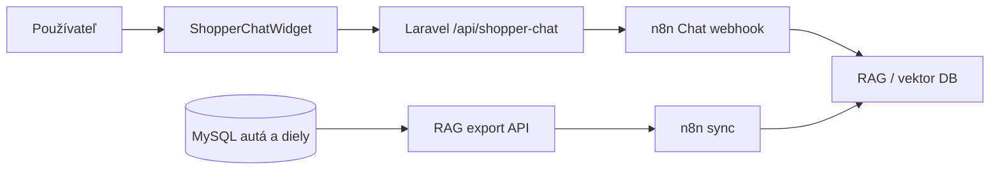

# Cars & Parts

Jednoduchá evidencia áut a dielov. Prihlásený používateľ môže pridávať autá (názov, EČV, či je evidované), ku každému autu viazať diely so sériovým číslom, filtrovať zoznamy a všetko klasicky upravovať alebo mazať.

Backend je Laravel 12, frontend Vue 3 cez Inertia, auth rieši Fortify. UI je Tailwind + shadcn-vue.

## Funkcie

- CRUD pre autá a diely, kategórie, filtre
- **RAG chatbot (Personal Shopper)** — plávajúci widget v pravom dolnom rohu pre prihlásených používateľov; prirodzeným jazykom vyhľadáva autá a diely v evidencii (cez n8n workflow a vektorové vyhľadávanie)
- **RAG export API** — JSON export kategórií a produktov pre synchronizáciu znalostnej bázy v n8n (Bearer token)

Všetky relevantné routy aplikácie sú chránené `auth` a `verified` middlewareom. Chat API je dostupné len pre prihlásených používateľov.

---

## Požiadavky (lokálne bez Dockeru)

- PHP 8.2+
- Composer
- Node.js (pre frontend build)
- MySQL alebo inú DB – v `.env.example` je nastavené MySQL a databáza `cars_parts`

## Ako to spustiť (lokálne)

1. Naklonuj repo, choď do priečinka projektu.
2. Spusti:
   ```bash
   composer install
   ```
3. Spusti setup:
   ```bash
   php artisan setup
   ```
   Príkaz sám spraví: skopíruje `.env.example` do `.env` (ak `.env` ešte neexistuje), vygeneruje kľúč ak chýba, migrácie, `storage:link`, `npm install` a `npm run build`. Pred prvým spustením alebo po ňom uprav `.env` a vyplň `DB_*` (databáza musí existovať). Ak nechceš frontend build, pridaj `--no-build`. Ak chceš seedovať DB, pridaj `--seed`.
4. Spusti server:
   ```bash
   php artisan serve
   ```

---

## Ako to spustiť (Docker Compose)

### Požiadavky

- Docker a Docker Compose
- Súbor `.env` v koreňovom priečinku projektu (nie je v image — mountuje sa do kontajnera)

### Postup

1. Naklonuj repo a vytvor `.env`:
   ```bash
   cp .env.example .env
   ```
2. Vygeneruj `APP_KEY` (na hoste, kde máš PHP):
   ```bash
   php artisan key:generate
   ```
   Ak nemáš PHP lokálne, môžeš kľúč doplniť ručne do `.env` (`APP_KEY=base64:...`).
3. Skontroluj v `.env`:
   - `APP_URL=http://localhost:8000` (port mapovaný v `docker-compose.yml`)
   - `DB_*` — v Compose sa `DB_HOST` v kontajneri `app` prepíše na `mysql`; databázu `cars_parts` vytvorí MySQL služba pri štarte
4. Spusti stack:
   ```bash
   docker compose up -d --build
   ```
   Pri prvom štarte entrypoint spustí migrácie. Aplikácia beží na **http://localhost:8000**.

5. Voliteľne — ukážkové dáta pre test RAG vyhľadávania:
   ```bash
   docker compose exec app php artisan db:seed
   ```

### Služby

| Služba | Účel |
|--------|------|
| `app` | Nginx + PHP-FPM, web na porte **8000** |
| `queue` | `php artisan queue:work` (databázová fronta) |
| `mysql` | MySQL 8.4, port z `DB_PORT` v `.env` (predvolene 3306) |

### Poznámky k Dockeru

- Po zmene premenných v `.env` (napr. nový `APP_KEY` alebo `N8N_CHAT_WEBHOOK_URL`) znovu vytvor kontajnery, aby sa načítal `env_file`:
  ```bash
  docker compose up -d --force-recreate app queue
  ```
- Logy aplikácie: `docker compose logs -f app`
- Artisan v kontajneri: `docker compose exec app php artisan …`

---

## RAG chatbot (Personal Shopper)

Widget **Personal Shopper** sa zobrazí prihláseným používateľom v layoute aplikácie (ikona chatu vpravo dole). Napíšeš otázku prirodzeným jazykom (napr. „brzdy na BMW“) a odpoveď príde z n8n workflow, ktoré vyhľadáva v indexovaných dátach z tejto aplikácie.

### Ako to funguje



1. **Export dát** — n8n (alebo iný pipeline) periodicky volá chránené API a načíta kategórie a produkty:
   - `GET /api/rag/categories`
   - `GET /api/rag/products`  
   Odpoveď obsahuje štruktúrované záznamy vrátane poľa `search_text` pre embedding / fulltext.
2. **Chat** — frontend pošle správu na `POST /api/shopper-chat`; Laravel ju preposiela na n8n Chat Trigger webhook.
3. **Odpoveď** — text z workflow sa zobrazí v widgete; `session_id` sa drží v `localStorage` pre kontinuitu konverzácie.

### Konfigurácia v `.env`

| Premenná | Účel |
|----------|------|
| `RAG_API_TOKEN` | Bearer token pre `GET /api/rag/*` (hlavička `Authorization: Bearer …` alebo `X-RAG-API-Token`) |
| `N8N_CHAT_WEBHOOK_URL` | URL Chat Trigger webhooku z n8n (Embedded Chat) — bez nej chat vráti 503 |

Príklad volania exportu:

```bash
curl -s -H "Authorization: Bearer tvoj-rag-token" \
  http://localhost:8000/api/rag/products | jq .
```

### n8n

1. Vo workflow nastav HTTP Request uzly na `http://app:80/api/rag/...` (z Docker siete) alebo `http://host.docker.internal:8000/...` z hosta — s hlavičkou `Authorization: Bearer ${N8N_RAG_API_TOKEN}`.
2. Indexuj `products` a `categories` do vektorovej DB (alebo iného retrievera).
3. Chat Trigger node — skopíruj webhook URL do `N8N_CHAT_WEBHOOK_URL`.
4. Po zmene `.env` reštartuj: `docker compose up -d --force-recreate app queue`.

### Testovacie dáta

Seeder `RagSearchSeeder` (volaný z `DatabaseSeeder`) naplní DB kurátorovanými autami a dielmi so synonymami a prekrývajúcimi sa termínmi — vhodné na ladenie RAG odpovedí:

```bash
php artisan db:seed
# alebo v Dockeri:
docker compose exec app php artisan db:seed
```

---

## Vývoj

- Frontend build v Docker image prebieha pri `docker build`; pre lokálny vývoj s HMR použij klasický `npm run dev` mimo Compose alebo vlastný workflow.
- Testy: `php artisan test` / `docker compose exec app php artisan test`
